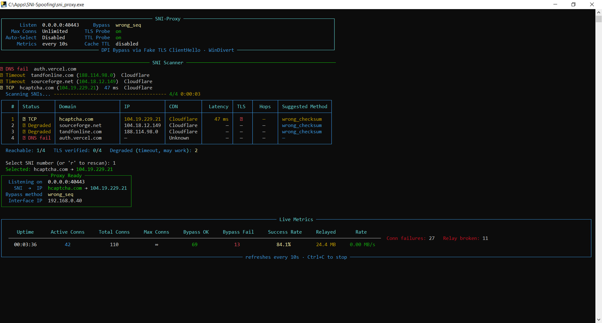

# SNI-Proxy

A Windows-based TCP proxy that bypasses **Deep Packet Inspection (DPI)** firewalls by injecting a fake TLS ClientHello with a spoofed SNI (Server Name Indication) using low-level IP/TCP header manipulation via WinDivert.

> Originally developed to help users in censored networks (e.g. Iran) access the free internet.

---

## 📬 Contact & Support

Have questions, feedback, or need help? Join the Telegram channel:

**➡️ [t.me/nulllroute1970](https://t.me/nulllroute1970)**

---

## Table of Contents

- [How It Works](#how-it-works)
- [Bypass Techniques](#bypass-techniques)
- [Choosing a Bypass Method](#choosing-a-bypass-method)
- [Project Structure](#project-structure)
- [Components](#components)
- [Configuration](#configuration)
- [SNI Scanner](#sni-scanner)
- [CDN Detection](#cdn-detection)
- [Requirements](#requirements)
- [Administrator Privileges & Firewall](#administrator-privileges--firewall)
- [Installation & Usage](#installation--usage)
- [Terminal Output](#terminal-output)
- [Architecture Diagram](#architecture-diagram)
- [Limitations](#limitations)

---

## How It Works

Many censorship systems use **DPI** to inspect the TLS handshake and block connections based on the **SNI field** in the ClientHello packet — the plaintext hostname the client sends before encryption begins.

This tool acts as a **local TCP proxy** with multiple DPI evasion strategies:

1. A client connects to the local proxy (e.g. `127.0.0.1:40443`).
2. The proxy establishes a TCP connection to the real upstream server.
3. Depending on the configured `BYPASS_METHOD`, the proxy uses one of several techniques to prevent the DPI from seeing the real SNI or to make it see an allowed one.
4. The proxy then transparently relays all subsequent traffic bidirectionally, effectively tunneling through the DPI filter.

---

## Bypass Techniques

Nine bypass methods are available. Set the `BYPASS_METHOD` field in `config.toml` to choose one.

### 1. `wrong_seq` (default)

Injects a fake ClientHello with a **deliberately wrong TCP sequence number** after the 3-way handshake completes.

- The fake payload is sent at sequence `SYN_SEQ + 1 - len(fake_payload)`, placing it **before** the logical byte stream start.
- **DPI** sees the packet as-is (many DPI engines don't do strict TCP reassembly) and evaluates the allowed SNI.
- **Server** correctly identifies the packet as out-of-order/overlapping data and **silently drops it**.
- Exploits the asymmetry between stateless DPI engines and compliant TCP stacks.

### 2. `wrong_checksum`

Injects a fake ClientHello with **valid sequence number but an invalid TCP checksum**.

- The fake payload uses the correct sequence number (`SYN_SEQ + 1`) so DPI sees it as valid data.
- The packet is sent **without recalculating checksums** — the payload change invalidates the original checksum.
- **DPI** engines that don't strictly validate TCP checksums accept the packet and see the allowed SNI.
- **Server** validates the TCP checksum, detects the mismatch, and **drops the packet silently**.

### 3. `low_ttl`

Injects a fake ClientHello with a **low IP TTL (Time-To-Live)** so it reaches the DPI but expires before the server.

- The fake payload uses the correct sequence number and valid checksums.
- The IP TTL is set to a low value (configurable via `FAKE_TTL`, default `1`).
- **DPI** (positioned on the network path, within a few hops) sees the packet and evaluates the allowed SNI.
- **Server** never receives the packet — routers decrement TTL to 0 and discard it before delivery.
- Requires tuning `FAKE_TTL` based on the number of hops between you and the DPI middlebox.

### 4. `tcp_segmentation`

Splits the **real TLS ClientHello** across multiple tiny TCP segments so DPI cannot reassemble the SNI.

- Unlike other methods, this does **not** inject a fake packet and does **not** use WinDivert packet interception.
- After connecting to the upstream server, the proxy reads the client's real ClientHello.
- It re-sends the ClientHello in tiny chunks (`SEGMENT_SIZE` bytes each, default `2`), with a small delay (`SEGMENT_DELAY` seconds, default `0.001`) between each chunk.
- `TCP_NODELAY` is enabled to force each small write into its own TCP segment.
- **DPI** sees many tiny fragments and cannot reconstruct the SNI from any single packet.
- **Server** TCP stack reassembles all segments normally — no data loss.

### 5. `duplicate_syn` *(experimental)*

Sends a **second SYN packet carrying the fake ClientHello** as payload data, immediately after the real SYN.

- After forwarding the real SYN (no payload), a duplicate SYN is sent with the fake ClientHello attached and the PSH flag set.
- **DPI** sees the SYN with data and evaluates the SNI from the ClientHello payload.
- **Server** treats the duplicate SYN as a retransmission and ignores the extra data.
- ⚠️ **Experimental**: Some servers or middleboxes may send a RST in response to a SYN with data payload. Use with caution.

### 6. `ip_fragmentation`

Sends the fake ClientHello as **two IP fragments** so the SNI field spans the fragment boundary.

- The fake packet is built with a wrong sequence number (like `wrong_seq`) for server-side safety.
- The IP packet is split into two fragments at the configurable offset (`IP_FRAG_OFFSET` bytes, default `8`, must be a multiple of 8).
- Fragment 1 carries the first portion of the TCP header + payload with `MF=1` (More Fragments).
- Fragment 2 carries the remainder with `MF=0`.
- **DPI** that doesn't perform IP reassembly sees incomplete data in each fragment and cannot extract the SNI.
- **Server** would normally reassemble the fragments, but discards the result because the TCP sequence number is wrong.

### 7. `fake_rst`

Sends a **fake RST (reset) packet** with a wrong sequence number to trick DPI into dropping connection state.

- After the 3-way handshake, a bare TCP RST is sent with `seq = SYN_SEQ` (off by one from expected).
- **DPI** sees the RST and believes the connection is closed — it stops tracking and inspecting this flow.
- **Server** evaluates the RST but rejects it because the sequence number doesn't match the expected value.
- Subsequent real data (including the actual ClientHello with the real SNI) passes through DPI uninspected.
- Bypass completion is signaled immediately after sending the RST (no server ACK expected).

### 8. `tls_record_frag`

Splits the real ClientHello into **multiple TLS record fragments** at the TLS layer.

- Like `tcp_segmentation`, this is an application-level method — no fake packet injection, no WinDivert.
- The proxy reads the client's real ClientHello, strips the 5-byte TLS record header, then re-wraps the handshake payload into multiple small TLS records (`TLS_RECORD_FRAG_SIZE` bytes each, default `5`).
- Each fragment is a valid TLS Handshake record (`0x16`) with the original version field.
- `TCP_NODELAY` is enabled and a small delay (`SEGMENT_DELAY`) is added between records.
- **DPI** sees multiple small TLS records — none containing the complete SNI field — and cannot reconstruct it.
- **Server** TLS stack reassembles the handshake message from multiple records normally.

### 9. `tcp_urgent_pointer`

Sends the fake ClientHello with the **TCP URG flag and an urgent pointer** to desync DPI's view of the data stream.

- The fake packet uses a wrong sequence number (like `wrong_seq`) and additionally sets the URG flag with `urg_ptr` set to `URGENT_POINTER_SIZE` (default `3`).
- **DPI** engines that don't properly handle TCP urgent data will misinterpret the byte stream boundaries, causing them to miss or misparse the SNI field.
- **Server** handles URG correctly but discards the packet due to the wrong sequence number.
- Combines two desync techniques (wrong seq + urgent pointer) for layered evasion.

---

## Project Structure

```
SNI-Proxy/
├── main.py                  # Entry point: async TCP proxy server
├── fake_tcp.py              # WinDivert-based packet injector & connection state machine
├── injecter.py              # Abstract base class for WinDivert injectors
├── monitor_connection.py    # TCP connection state tracker (SYN/SYN-ACK seq numbers)
├── metrics.py               # Thread-safe connection metrics & periodic dashboard
├── config.toml              # Runtime configuration (TOML format with parameter descriptions)
├── sni_list.txt             # List of SNI domains to check and select from at startup
├── requirements.txt         # Python dependencies
└── utils/
    ├── network_tools.py     # Local interface IP detection
    └── packet_templates.py  # TLS ClientHello / ServerHello packet builder & parser
```

---

## Components

### `main.py` — Async Proxy Server

The entry point. Responsibilities:

- Reads `config.toml` for all runtime parameters.
- Detects the local outbound network interface IP via `get_default_interface_ipv4`.
- Starts a `FakeTcpInjector` in a background daemon thread (WinDivert intercept loop).
- Runs an `asyncio`-based TCP listener that accepts client connections and dispatches each to `handle()`.

**`handle()`** coroutine flow:
1. Constructs a fake TLS ClientHello (random nonces, spoofed SNI, random key share) using `ClientHelloMaker`.
2. Opens a non-blocking outbound socket, registers it with the injector, and connects to the upstream server.
3. Waits (with a 2-second timeout) for the injector to signal `fake_data_ack_recv` — confirming the DPI bypass succeeded.
4. Enters bidirectional relay mode (`relay_main_loop`) passing data between the client and upstream server transparently.

---

### `fake_tcp.py` — Packet Injector & State Machine

#### `FakeInjectiveConnection`

Subclasses `MonitorConnection`. Holds per-connection state:

| Field | Description |
|---|---|
| `fake_data` | The forged TLS ClientHello bytes to inject |
| `sch_fake_sent` | Whether fake injection has been scheduled |
| `fake_sent` | Whether the fake packet was actually sent |
| `t2a_event` | `asyncio.Event` used to signal the main coroutine |
| `t2a_msg` | Result message: `"fake_data_ack_recv"` or `"unexpected_close"` |
| `bypass_method` | Bypass strategy (`"wrong_seq"`, `"wrong_checksum"`, `"low_ttl"`, `"duplicate_syn"`, `"ip_fragmentation"`, `"fake_rst"`, or `"tcp_urgent_pointer"`) |
| `fake_ttl` | TTL value for `low_ttl` method |
| `ip_frag_offset` | Fragment split offset for `ip_fragmentation` method |
| `urgent_pointer_size` | Urgent pointer value for `tcp_urgent_pointer` method |
| `fake_inject_delay` | Seconds to delay before injecting fake packet |

#### `FakeTcpInjector`

Subclasses `TcpInjector`. Intercepts all TCP packets for tracked connections using WinDivert and drives a strict state machine:

**Outbound packet handling:**
- `SYN` — records `syn_seq`, forwards normally. For `duplicate_syn`, also sends a second SYN with fake data.
- `ACK` (post-handshake, no payload, no fake yet sent) — forwards the ACK. For methods other than `duplicate_syn`, schedules `fake_send_thread` with a 1 ms delay.
- Any other packet after injection started — treated as unexpected, closes connection.

**`fake_send_thread`** (used by `wrong_seq`, `wrong_checksum`, `low_ttl`, `ip_fragmentation`, `fake_rst`, `tcp_urgent_pointer`):
- Modifies the captured ACK packet in-place:
  - Sets `PSH` flag.
  - Replaces payload with `fake_data`.
  - Bumps the IP identification field to distinguish it from the real ACK.
  - **`wrong_seq`**: Sets sequence number to `SYN_SEQ + 1 - len(fake_data)`. Sends with checksum recalculation.
  - **`wrong_checksum`**: Uses correct sequence number `SYN_SEQ + 1`. Sends **without** checksum recalculation (stale checksum = invalid).
  - **`low_ttl`**: Uses correct sequence number `SYN_SEQ + 1`. Sets `ipv4.ttl` to configured `FAKE_TTL`. Sends with checksum recalculation.
  - **`ip_fragmentation`**: Uses wrong sequence number. Splits the raw packet into two IP fragments at `IP_FRAG_OFFSET` boundary and sends each fragment separately.
  - **`fake_rst`**: Strips the payload, sets RST flag, uses wrong seq. Signals bypass completion immediately (no server ACK expected).
  - **`tcp_urgent_pointer`**: Uses wrong sequence number. Sets URG flag and `urg_ptr` to `URGENT_POINTER_SIZE`.
- Sends the forged packet via WinDivert.

**Inbound packet handling:**
- `SYN-ACK` — validates sequence/ACK numbers, records `syn_ack_seq`, forwards.
- Pure `ACK` (after fake was sent) — validates it acknowledges the fake data, signals `t2a_event` with `"fake_data_ack_recv"`, halts monitoring.
- Anything unexpected — closes both sockets, signals `"unexpected_close"`.

---

### `injecter.py` — Abstract WinDivert Injector

`TcpInjector` is an abstract base class that:

- Accepts a WinDivert filter string and opens a `WinDivert` handle.
- Runs a blocking receive loop, dispatching each captured packet to the abstract `inject()` method.
- Subclasses implement `inject()` to decide per-packet handling.

---

### `monitor_connection.py` — Connection State Tracker

`MonitorConnection` is a lightweight dataclass-style class tracking:

- Connection 4-tuple: `(src_ip, src_port, dst_ip, dst_port)` → used as the dict key.
- `syn_seq` / `syn_ack_seq`: The sequence numbers from the SYN and SYN-ACK packets.
- `monitor`: Boolean flag; when `False`, the injector stops intercepting and lets packets pass through normally.
- `thread_lock`: Mutex protecting state shared between the WinDivert thread and the asyncio thread.

---

### `metrics.py` — Connection Metrics Dashboard

Thread-safe counters for monitoring proxy activity. A module-level `ConnectionMetrics` singleton tracks:

| Counter | Description |
|---|---|
| `active_connections` | Currently open proxy connections |
| `total_connections` | Lifetime total connections handled |
| `successful_bypasses` | Bypass attempts that succeeded |
| `failed_bypasses` | Bypass attempts that failed (timeout, RST, unexpected packet) |
| `bytes_relayed` | Total bytes forwarded through the relay |
| `connect_failed` | Outgoing TCP connections to the server that could not be established |
| `relay_broken` | Active relays interrupted by a connection reset (RST) or network error |

Uses `threading.Lock` so both the asyncio event loop (`main.py`) and the WinDivert injector thread (`fake_tcp.py`) can safely update counters. When `METRICS_INTERVAL > 0`, an asyncio task in `main()` prints a compact color-coded status line to the console periodically (see [Terminal Output Colors](#terminal-output-colors)):

```
[metrics] uptime=00:01:30  active=2  total=15  bypass_ok=13  bypass_fail=0  relayed=1.2 MB
```

`conn_fail` and `relay_broken` are appended to the line **only when their count is non-zero**, to avoid clutter during normal operation:

```
[metrics] uptime=00:01:30  active=2  total=15  bypass_ok=13  bypass_fail=1  relayed=1.2 MB  conn_fail=2  relay_broken=1
```

---

### `utils/network_tools.py` — Interface Detection

`get_default_interface_ipv4(addr)` — Opens a UDP socket toward `addr` (no data sent) and reads back the OS-assigned source IP, effectively discovering which interface the system would use to reach that destination.

`get_default_interface_ipv6(addr)` — Same for IPv6.

---

### `utils/packet_templates.py` — TLS Packet Builder

#### `ClientHelloMaker`

Builds and parses a fixed-structure **TLS 1.3 ClientHello** (517 bytes) with:

- Randomisable fields: 32-byte random, 32-byte session ID, SNI hostname, 32-byte key share.
- Fixed cipher suites, extensions (ALPN: `h2`/`http/1.1`, supported groups, signature algorithms, supported versions, PSK mode).
- A **padding extension** (`0x0015`) sized dynamically to keep total length constant regardless of SNI length.
- `get_client_hello_with(rnd, sess_id, target_sni, key_share)` — assembles the packet.
- `parse_client_hello(data)` — extracts the variable fields; asserts round-trip fidelity.

#### `ServerHelloMaker`

Symmetric builder/parser for a fixed-structure **TLS 1.3 ServerHello** used for testing purposes.

---

## Choosing a Bypass Method

Not all methods work equally well on every network. The table below gives a practical guide based on the DPI capabilities commonly found in heavily censored networks (e.g. Iran, China).

### Effectiveness by Tier

#### Tier 1 — Highest Success Rate (start here)

| Method | Why it works |
|---|---|
| `tls_record_frag` | Splits the ClientHello at the TLS layer into ≤5-byte records. Most DPI engines do not reassemble TLS-layer fragments, so the SNI is never visible in any single packet. No WinDivert injection required — most stable and portable. |
| `tcp_segmentation` | Sends the ClientHello in 2-byte TCP segments. Stateless DPI commonly fails at sub-MTU TCP stream reassembly and cannot extract the SNI. Also requires no injection. |
| `fake_rst` | A fake RST tricks stateful DPI into dropping its connection tracking state. The real ClientHello then passes through uninspected. Very clean when the DPI is stateful. |

#### Tier 2 — Usually Works, May Need Tuning

| Method | Notes |
|---|---|
| `wrong_seq` | The classic technique. Effective against DPI that does not perform strict TCP stream reassembly. Still works on many ISPs. Good fallback if Tier 1 methods fail. |
| `low_ttl` | Highly reliable **when tuned correctly**. Run `tracert <target-server>` to count hops and set `FAKE_TTL` to a value that reaches the DPI middlebox but expires before the server (typically `3`–`6` hops). |

#### Tier 3 — Situational

| Method | Notes |
|---|---|
| `wrong_checksum` | Only effective against DPI that skips checksum validation. Modern DPI systems (post-2020) mostly validate checksums, so this is unreliable on up-to-date infrastructure. |
| `ip_fragmentation` | Works only if the DPI does not reassemble IP fragments. Effectiveness varies per ISP and can change as DPI firmware is updated. |
| `tcp_urgent_pointer` | Layers URG-flag desync on top of `wrong_seq`. Marginally more evasive than plain `wrong_seq` but not dramatically different in practice. |

#### Tier 4 — Avoid in Production

| Method | Notes |
|---|---|
| `duplicate_syn` | Experimental. Many servers and middleboxes send RST in response to a SYN-with-payload, making connections unreliable. Use only for testing. |

### Recommended Trial Order

1. **`tls_record_frag`** — start here; works at the application layer, no WinDivert tuning needed.
2. **`tcp_segmentation`** — try next if TLS record fragmentation is detected or blocked.
3. **`fake_rst`** — try if a stateful DPI is suspected and injection-based methods are available.
4. **`wrong_seq`** — reliable general-purpose fallback for injection-based evasion.
5. **`low_ttl`** — use when you know the hop count; run `tracert` first and set `FAKE_TTL` accordingly.

> No single method is guaranteed since DPI systems are actively updated. If one method stops working, move down the list or combine tuning parameters (e.g. reduce `SEGMENT_SIZE` or `TLS_RECORD_FRAG_SIZE` further).

---

## Configuration

All settings are in `config.toml`, which uses the [TOML](https://toml.io/) format. Each parameter includes a detailed description as inline comments. Open the file in any text editor to review and customize.

Key parameters:

| Parameter | Description | Default |
|---|---|---|
| `LISTEN_HOST` | Local address the proxy listens on | `"127.0.0.1"` |
| `LISTEN_PORT` | Local port the proxy listens on | `40443` |
| `CONNECT_PORT` | (Optional) Target server port | `443` |
| `BYPASS_METHOD` | DPI evasion technique to use (see [Bypass Techniques](#bypass-techniques)) | `"wrong_seq"` |
| `FAKE_TTL` | IP TTL for `low_ttl` method | `1` |
| `SEGMENT_SIZE` | Bytes per segment for `tcp_segmentation` | `2` |
| `SEGMENT_DELAY` | Delay between segments (seconds) for `tcp_segmentation` / `tls_record_frag` | `0.001` |
| `IP_FRAG_OFFSET` | Fragment split offset for `ip_fragmentation` (must be multiple of 8) | `8` |
| `TLS_RECORD_FRAG_SIZE` | Bytes per TLS record fragment for `tls_record_frag` | `5` |
| `URGENT_POINTER_SIZE` | Urgent data prefix size for `tcp_urgent_pointer` | `3` |
| `BYPASS_TIMEOUT` | Seconds to wait for bypass confirmation (injection methods) | `2` |
| `CLIENT_DATA_TIMEOUT` | Seconds to wait for client's first data (segmentation methods) | `5` |
| `FAKE_INJECT_DELAY` | Seconds to delay before injecting the fake packet | `0.001` |
| `KEEPALIVE_IDLE` | Seconds idle before first TCP keep-alive probe | `11` |
| `KEEPALIVE_INTERVAL` | Seconds between TCP keep-alive probes | `2` |
| `KEEPALIVE_COUNT` | Max keep-alive probes before dropping connection | `3` |
| `METRICS_INTERVAL` | Seconds between console metrics output (`0` = disabled) | `10` |
| `SHOW_FAILED_SNIS` | Show DNS-fail SNIs (no IP) in the selection list; **Degraded** SNIs (TCP fail, IP known) are always shown | `true` |
| `SCAN_WORKERS` | Concurrent threads for SNI scanning | `20` |
| `SCAN_TIMEOUT` | Per-SNI scan timeout (seconds) | `2.0` |
| `SCAN_TLS_PROBE` | Verify TLS handshake during scan (not just TCP) | `true` |
| `SCAN_TTL_PROBE` | Estimate hop count via ICMP ping | `true` |
| `SCAN_CACHE_TTL` | Seconds to cache scan results (`0` = always rescan) | `300` |
| `SCAN_DEGRADED_RETRIES` | Extra retry attempts for timeout-degraded SNIs (`0` = disabled) | `2` |
| `SCAN_DEGRADED_TIMEOUT` | Timeout per retry attempt for degraded SNIs (seconds) | `5.0` |
| `AUTO_SELECT_SNI` | Auto-pick best SNI without interactive prompt | `false` |
| `AUTO_SELECT_INTERVAL` | Minutes between background SNI re-scans (only when `AUTO_SELECT_SNI = true`, `0` = disabled) | `5` |
| `MAX_CONNECTIONS` | Max simultaneous proxy connections (`0` = unlimited) | `100` || `RELAY_BUFFER_SIZE` | Read buffer size per relay direction in bytes (4096–1048576) | `262144` |
| `SOCKET_BUFFER_SIZE` | OS-level socket send/receive buffer size in bytes (4096–4194304) | `262144` |
| `INJECTION_POOL_SIZE` | Worker threads for fake packet injection (1–256) | `32` |
Edit `config.toml` before running. Only `LISTEN_HOST` and `LISTEN_PORT` are required (SNI is configured in `sni_list.txt`):

```toml
LISTEN_HOST = "127.0.0.1"
LISTEN_PORT = 40443
```

Full configuration with all options:

```toml
LISTEN_HOST = "127.0.0.1"
LISTEN_PORT = 40443
CONNECT_PORT = 443
BYPASS_METHOD = "wrong_seq"
FAKE_TTL = 1
SEGMENT_SIZE = 2
SEGMENT_DELAY = 0.001
IP_FRAG_OFFSET = 8
TLS_RECORD_FRAG_SIZE = 5
URGENT_POINTER_SIZE = 3
BYPASS_TIMEOUT = 2
CLIENT_DATA_TIMEOUT = 5
FAKE_INJECT_DELAY = 0.001
KEEPALIVE_IDLE = 11
KEEPALIVE_INTERVAL = 2
KEEPALIVE_COUNT = 3
METRICS_INTERVAL = 10
SHOW_FAILED_SNIS = true
SCAN_WORKERS = 20
SCAN_TIMEOUT = 2.0
SCAN_TLS_PROBE = true
SCAN_TTL_PROBE = true
SCAN_CACHE_TTL = 300
SCAN_DEGRADED_RETRIES = 2
SCAN_DEGRADED_TIMEOUT = 5.0
AUTO_SELECT_SNI = false
AUTO_SELECT_INTERVAL = 5
MAX_CONNECTIONS = 100
```

| Key | Description |
|---|---|
| `LISTEN_HOST` | IP the local proxy binds to. Use `127.0.0.1` for local-only. |
| `LISTEN_PORT` | Local port clients connect to. |
| `CONNECT_PORT` | *(Optional)* Upstream port. Defaults to `443` if omitted. |
| `BYPASS_METHOD` | *(Optional)* DPI evasion technique. One of: `wrong_seq`, `wrong_checksum`, `low_ttl`, `tcp_segmentation`, `duplicate_syn`, `ip_fragmentation`, `fake_rst`, `tls_record_frag`, `tcp_urgent_pointer`. Defaults to `wrong_seq`. |
| `FAKE_TTL` | *(Optional)* IP TTL for the fake packet when using `low_ttl`. Defaults to `1`. Increase if DPI is more than 1 hop away. |
| `SEGMENT_SIZE` | *(Optional)* Bytes per TCP segment when using `tcp_segmentation`. Defaults to `2`. Smaller = more segments = harder for DPI, but slower. |
| `SEGMENT_DELAY` | *(Optional)* Seconds between segment/record sends for `tcp_segmentation` and `tls_record_frag`. Defaults to `0.001` (1 ms). |
| `IP_FRAG_OFFSET` | *(Optional)* Split offset in bytes for `ip_fragmentation` (must be a multiple of 8). Defaults to `8`. |
| `TLS_RECORD_FRAG_SIZE` | *(Optional)* Bytes per TLS record fragment for `tls_record_frag`. Defaults to `5`. |
| `URGENT_POINTER_SIZE` | *(Optional)* Urgent pointer value for `tcp_urgent_pointer`. Defaults to `3`. |
| `BYPASS_TIMEOUT` | *(Optional)* Seconds to wait for the packet injector to confirm bypass success. Defaults to `2`. Increase on high-latency networks. |
| `CLIENT_DATA_TIMEOUT` | *(Optional)* Seconds to wait for the client's first data (used by `tcp_segmentation` and `tls_record_frag`). Defaults to `5`. |
| `FAKE_INJECT_DELAY` | *(Optional)* Seconds to delay before injecting the fake packet after the handshake ACK. Defaults to `0.001` (1 ms). |
| `KEEPALIVE_IDLE` | *(Optional)* Seconds of idle time before the first TCP keep-alive probe. Defaults to `11`. |
| `KEEPALIVE_INTERVAL` | *(Optional)* Seconds between successive TCP keep-alive probes. Defaults to `2`. |
| `KEEPALIVE_COUNT` | *(Optional)* Maximum keep-alive probes before the connection is dropped. Defaults to `3`. |
| `METRICS_INTERVAL` | *(Optional)* Seconds between printing connection metrics to the console. Set to `0` to disable. Defaults to `10`. |
| `SHOW_FAILED_SNIS` | *(Optional)* Whether to show SNIs that failed **DNS resolution** (no IP) in the selection list. SNIs that resolved DNS but failed TCP connect are always shown as **Degraded** — they may still work despite the TCP check failing. `true` shows DNS-fail SNIs too; `false` hides them so only reachable and degraded SNIs appear. Defaults to `true`. |
| `SCAN_WORKERS` | *(Optional)* Number of concurrent threads used for parallel SNI scanning. Higher values speed up large lists. Defaults to `20`. |
| `SCAN_TIMEOUT` | *(Optional)* Per-SNI timeout in seconds for DNS + TCP + TLS probes. Increase on high-latency networks. Defaults to `2.0`. |
| `SCAN_TLS_PROBE` | *(Optional)* When `true`, the scanner verifies a full TLS handshake after TCP connect — a stronger reachability signal. Set to `false` for TCP-only checks (faster). Defaults to `true`. |
| `SCAN_TTL_PROBE` | *(Optional)* When `true`, the scanner pings each reachable IP to estimate hop count (useful for tuning `FAKE_TTL`). Set to `false` to skip (faster, or if ICMP is blocked). Defaults to `true`. |
| `SCAN_CACHE_TTL` | *(Optional)* Seconds to cache scan results in `sni_scan_cache.json`. Subsequent launches within this window reuse cached results. Set to `0` to always rescan. Defaults to `300`. |
| `SCAN_DEGRADED_RETRIES` | *(Optional)* Number of extra retry attempts for SNIs that timed out during the main parallel scan. Each retry uses `SCAN_DEGRADED_TIMEOUT`. A successful retry promotes the SNI to fully reachable; a "refused" response on retry downgrades it further. Set to `0` to disable. Defaults to `2`. |
| `SCAN_DEGRADED_TIMEOUT` | *(Optional)* Timeout in seconds for each degraded-SNI retry attempt. Should be longer than `SCAN_TIMEOUT` to give slow or rate-limited servers a fair chance. Defaults to `5.0`. |
| `AUTO_SELECT_SNI` | *(Optional)* When `true`, the scanner auto-selects the best SNI (TLS verified, lowest latency) without showing the interactive prompt. Defaults to `false`. |
| `AUTO_SELECT_INTERVAL` | *(Optional)* How often (in **minutes**) to re-scan SNIs in the background and switch to the best available one. Only active when `AUTO_SELECT_SNI = true`. If only the resolved IP changes (e.g. CDN rotation), the same domain is kept but the connection target is updated and the WinDivert filter is restarted. Set to `0` to disable background refresh. Defaults to `5`. |
| `MAX_CONNECTIONS` | *(Optional)* Maximum number of simultaneous proxy connections. New connections wait when the limit is reached. Set to `0` for unlimited (not recommended in production). Defaults to `100`. |
| `RELAY_BUFFER_SIZE` | *(Optional, advanced)* Read buffer size in bytes used per relay direction when forwarding data between client and server. Larger values reduce syscall overhead on fast/high-latency links; reduce on memory-constrained systems. Must be 4096–1048576. Defaults to `262144` (256 KB). |
| `SOCKET_BUFFER_SIZE` | *(Optional, advanced)* OS-level `SO_RCVBUF`/`SO_SNDBUF` set on every proxy socket. Helps on high-bandwidth links by letting the kernel buffer more data in flight. Must be 4096–4194304. Defaults to `262144` (256 KB). |
| `INJECTION_POOL_SIZE` | *(Optional, advanced)* Number of threads in the shared pool used for fake packet injection. Each active bypass occupies a thread for ~1 ms. Increase for hundreds of new connections per second; reduce on resource-constrained systems. Must be 1–256. Has no effect for `tcp_segmentation` or `tls_record_frag`. Defaults to `32`. |

---

## CDN Detection

Each IP shown in the SNI scan is automatically labeled with the CDN provider that owns it. The label appears next to the IP in the startup selection list (e.g. `76.76.21.21 · Cloudflare`).

CDN IP ranges are loaded from `cdn_ranges.json` (in the same directory as `config.toml`). The file uses a simple JSON object where each key is a CDN name and its value is a list of IPv4 CIDR strings:

```json
{
    "Cloudflare": ["103.21.244.0/22", "..."],
    "Amazon CloudFront": ["13.32.0.0/15", "..."],
    "Fastly": ["23.235.32.0/20", "..."],
    "Akamai": ["2.16.0.0/13", "..."],
    "Google Cloud CDN": ["142.250.0.0/15", "..."],
    "Microsoft Azure CDN": ["13.107.224.0/24", "..."]
}
```

### Currently Included Providers

| Provider | Source |
|---|---|
| Cloudflare | [cloudflare.com/ips](https://www.cloudflare.com/ips/) |
| Amazon CloudFront | [AWS ip-ranges.json](https://ip-ranges.amazonaws.com/ip-ranges.json) (CLOUDFRONT service) |
| Fastly | [api.fastly.com/public-ip-list](https://api.fastly.com/public-ip-list) |
| Akamai | [Akamai TechDocs](https://techdocs.akamai.com/origin-ip-acl/docs/update-your-origin-server) (current ranges only) |
| Google Cloud CDN | [gstatic.com/ipranges/goog.json](https://www.gstatic.com/ipranges/goog.json) |
| Microsoft Azure CDN | Azure IP Ranges (AzureCDN service tag) |

### Adding or Updating Ranges

- IPs that don't match any provider are shown as `Unknown`.
- To add a new CDN, append a new key/value entry to `cdn_ranges.json`. No code changes are needed.
- The file is loaded once at startup. Restart the app after editing.

---

## Requirements

- **Windows only** — relies on [WinDivert](https://reqrypt.org/windivert.html) for kernel-level packet interception.
- Python 3.10+
- [`pydivert`](https://pypi.org/project/pydivert/) ≥ 3.1.0 (Python bindings for WinDivert)
- [`rich`](https://pypi.org/project/rich/) ≥ 13.0.0 (beautiful terminal UI: tables, progress bars, live panels)
- [`colorama`](https://pypi.org/project/colorama/) ≥ 0.4.6 (ANSI color support on Windows, used internally by rich)

Install dependencies:

```bash
pip install -r requirements.txt
```

> WinDivert requires the `WinDivert.dll` and `WinDivert.sys` driver files to be accessible. `pydivert` bundles these automatically.

---

## Administrator Privileges & Firewall

### Why Administrator rights are required

WinDivert installs a Windows kernel packet filter. Opening that filter requires a process running with elevated (Administrator) privileges. `tcp_segmentation` and `tls_record_frag` bypass methods do not use WinDivert but still run through the same proxy infrastructure, so the requirement applies to all methods.

### Automatic UAC elevation

The application handles elevation automatically — you do **not** need to manually right-click and choose "Run as Administrator".

**Running as a Python script (`python main.py`):**
On startup, `main.py` calls `ctypes.windll.shell32.IsUserAnAdmin()`. If the process is not elevated, it immediately re-launches itself via `ShellExecuteW` with the `runas` verb, which triggers the standard Windows UAC consent dialog. The original (unelevated) process exits immediately; the elevated copy takes over.

**Running as a built EXE (`sni_proxy.exe`):**
The EXE has a `requireAdministrator` execution level embedded in its PE manifest (added by PyInstaller's `uac_admin=True` / `--uac-admin` option). Windows reads this manifest before the process even starts and automatically shows the UAC prompt. No Python elevation code is involved — the process is already elevated by the time `main.py` runs.

### Windows Firewall rule

On every launch, the proxy automatically creates a Windows Firewall inbound rule allowing TCP traffic on `LISTEN_PORT` (default `40443`) if the rule does not already exist. The rule is named `SNI-Proxy-<port>` (e.g. `SNI-Proxy-40443`).

- **Idempotent** — the rule is checked with `netsh advfirewall firewall show rule` before creation; if it already exists, no duplicate is created and no message is printed.
- **First-run log message** — when the rule is first created you will see:
  ```
  Windows Firewall: created inbound TCP allow rule for port 40443 ('SNI-Proxy-40443').
  ```
- **Port-scoped** — changing `LISTEN_PORT` in `config.toml` creates a new rule for the new port without affecting existing rules.
- **To remove the rule manually** (e.g. after uninstalling):
  ```powershell
  netsh advfirewall firewall delete rule name=SNI-Proxy-40443
  ```

---

## Installation & Usage

1. **Clone the repository:**
   ```bash
   git clone https://github.com/nullroute1970/SNI-Proxy.git
   cd SNI-Proxy
   ```

2. **Install dependencies:**
   ```bash
   pip install -r requirements.txt
   ```

3. **Edit `config.toml`** with your desired proxy settings (listen address/port, bypass method, etc.).

4. **Edit `sni_list.txt`** — add SNI domains you want to try (one per line). At least one domain is required. See [SNI List](#sni-list) for details.

5. **Run the app** (Administrator privileges are required and handled automatically):
   ```bash
   python main.py
   ```
   If not already running as Administrator, a Windows UAC prompt will appear — approve it and the elevated process starts automatically. When running the built EXE, Windows prompts for elevation before the process starts (embedded manifest). The app will then scan all SNIs from `sni_list.txt` and display a selection menu. See [SNI List](#sni-list).

6. **Point your client** (browser, proxy client, VPN app, etc.) at `127.0.0.1:40443`.

---

## SNI Scanner

SNI domains are configured in `sni_list.txt` (placed in the same directory as `config.toml`). This file is **required** — the app will not start without at least one SNI domain.

### Format

```
# Lines starting with # are comments
# Blank lines are ignored
sourceforge.net
auth.vercel.com
cloudflare.com
```

### Startup Behavior

When you run the app, the enhanced SNI scanner runs with up to 5 checks per SNI:

1. **DNS Resolution** — resolves the domain to an IPv4 address.
2. **TCP Connect** — attempts a TCP connection on port 443 (or `CONNECT_PORT`) and measures **round-trip latency** in milliseconds.
3. **TLS Handshake Probe** *(if `SCAN_TLS_PROBE = true`)* — opens a fresh socket and performs a full TLS handshake using the SNI as `server_hostname`, verifying the server actually speaks TLS.
4. **TTL/Hop Estimation** *(if `SCAN_TTL_PROBE = true`)* — sends an ICMP ping and estimates the number of network hops from the reply TTL. Useful for tuning `FAKE_TTL` when using the `low_ttl` bypass method.
5. **CDN Detection** — matches the resolved IP against known CDN ranges from `cdn_ranges.json`.

All SNIs are checked in parallel using `SCAN_WORKERS` threads (default 20). As each host finishes probing, a status line is printed immediately so you can follow progress in real time:

```
✓ TLS  auth.vercel.com (76.76.21.21)  45 ms  Cloudflare
✓ TLS  cloudflare.com (104.16.132.229)  38 ms  Cloudflare
⚠ TCP  sourceforge.net (216.105.38.13)  92 ms
⚠ Timeout  timeout.example.com (93.184.216.34)
✗ Refused  refused.example.com (198.51.100.1)
✗ DNS fail  broken.example.com
Scanning SNIs... ━━━━━━━━━━━━━━━━━━━━ 6/6  0:00:04
```

If any hosts timed out during the initial pass, a retry pass runs with a longer timeout and each retry result is printed with a `↻` prefix:

```
↻ ✓ TLS  timeout.example.com (93.184.216.34)  210 ms
```

### Results Display

Results are **sorted by quality** (TLS verified → TCP only → DNS only → failed) then by latency (fastest first). A Rich table is displayed with the following columns:

```
─────────────────────────────────────────────────────────────────────────────────────────
  #   Status      Domain                  IP              CDN          Latency   TLS  Hops   Suggested Method
─────────────────────────────────────────────────────────────────────────────────────────
  1   ✓ TLS       auth.vercel.com         76.76.21.21     Cloudflare    45 ms     ✓   ~5     low_ttl (FAKE_TTL=4)
  2   ✓ TLS       cloudflare.com          104.16.132.229  Cloudflare    38 ms     ✓   ~3     low_ttl (FAKE_TTL=2)
  3   ⚠ TCP       sourceforge.net         216.105.38.13   Unknown       92 ms     ✗   ~8     wrong_seq
  4   ⚠ Degraded  timeout.example.com     93.184.216.34   CloudFront    —         —   —      wrong_seq
  5   ✗ Refused   refused.example.com     198.51.100.1    Unknown       —         —   —      —
  6   ✗ DNS fail  broken.example.com      —               —             —         —   —      —
─────────────────────────────────────────────────────────────────────────────────────────

  Reachable: 3/6   TLS verified: 2/6   Degraded (timeout, may work): 1
```

Column meanings:

| Column | Description |
|---|---|
| `✓ TLS` | TLS handshake verified (green) |
| `⚠ TCP` | TCP reachable but TLS probe failed (yellow) |
| `⚠ Degraded` | TCP timed out — DNS resolved and IP known; the fast parallel scan may have hit rate-limiting or jitter. A retry pass re-probes these with a longer timeout. If still timing out, marked Degraded: **may still work through the proxy** (dimmed yellow) |
| `✗ Refused` | Server sent RST — actively rejecting the connection; unlikely to work |
| `✗ DNS fail` | DNS resolution failed — cannot be used |
| Latency | TCP connect round-trip time |
| `TLS:✓` / `TLS:✗` | Whether a full TLS handshake succeeded |
| `Hops:~N` | Estimated network hops from ping TTL |
| `→ method` | Suggested bypass method based on CDN and hop count |

### Bypass Method Suggestions

The scanner automatically suggests a bypass method for each reachable SNI:

- **Known hop count (1–15 hops)** → `low_ttl` with a recommended `FAKE_TTL` value (`hops - 1`).
- **Cloudflare / Fastly / Akamai CDN** → `wrong_checksum` (these CDNs tend to work well with checksum-based evasion).
- **Other / Unknown CDN** → `wrong_seq` (reliable general-purpose fallback).

> These are suggestions only. The actual bypass method is set by `BYPASS_METHOD` in `config.toml`.

### Result Caching

Scan results are cached in `sni_scan_cache.json` (auto-created next to `sni_list.txt`). On subsequent launches within `SCAN_CACHE_TTL` seconds (default 300), cached results are reused — dramatically speeding up startup with large SNI lists.

- **To force a fresh scan**: type `r` or `rescan` at the selection prompt.
- **To disable caching entirely**: set `SCAN_CACHE_TTL = 0` in `config.toml`.
- **Cache is safe to delete** — it will be recreated on the next run.

### Auto-Select Mode

Set `AUTO_SELECT_SNI = true` in `config.toml` to skip the interactive prompt. The scanner will automatically pick the best SNI — prioritizing TLS-verified results with the lowest latency.

#### Background Refresh

When `AUTO_SELECT_SNI = true`, the proxy also re-scans your SNI list in the background at the interval set by `AUTO_SELECT_INTERVAL` (minutes). On each refresh:

- If a **better SNI** is found (higher TLS/TCP score or lower latency), the proxy switches to it and prints a colored message to the console.
- If the **same SNI** is still best but its **resolved IP changed** (e.g. due to CDN rotation or DNS failover), the IP is updated and the WinDivert filter is restarted to match the new address.
- **Existing connections are not dropped** — each connection snapshots the SNI/IP at the moment it starts, so in-flight traffic is unaffected by a background refresh.
- Set `AUTO_SELECT_INTERVAL = 0` to disable background refresh while keeping `AUTO_SELECT_SNI = true`.

### Selection Prompt

In interactive mode (default), you can:

- **Enter a number** to select an SNI.
- **Type `r` or `rescan`** to clear the cache and re-run the full scan.

### Notes

- **Degraded SNIs (`⚠ Degraded`) can be selected** — TCP timed out in both the main scan and the retry pass, but the DPI bypass may still allow the connection. This happens when the DPI drops direct connections but lets spoofed-SNI traffic through, or when the server rate-limited the scanner. Expect potentially higher latency or instability.
- **Refused SNIs (`✗ Refused`) are shown when `SHOW_FAILED_SNIS = true`** — the server sent a TCP RST, actively rejecting the connection. These are unlikely to work but can still be selected with a warning.
- **SNIs that fail DNS resolution cannot be selected** — the app needs a valid IP to proceed.
- **If `sni_list.txt` is missing or empty**, the app will exit with an error.
- **TLS probe uses `CERT_NONE`** — certificate validation is intentionally disabled since we only care about reachability, not certificate trust.
- **Hop estimation uses ICMP** — if your network blocks ping, set `SCAN_TTL_PROBE = false` to skip it.

---

## Terminal Output



All console output uses [`rich`](https://pypi.org/project/rich/) for styled, structured terminal UI.

### Startup Banner

On launch, a config summary panel is shown before the SNI scanner:

```
╭─────────────────────────────────────────────────────╮
│              SNI-Proxy                              │
│  DPI Bypass via Fake TLS ClientHello · WinDivert    │
│                                                     │
│   Listen       0.0.0.0:40443    Bypass    wrong_seq │
│   Max Conns    100              TLS Probe  on       │
│   Auto-Select  Disabled         TTL Probe  on       │
│   Metrics      every 10s        Cache TTL  300s     │
╰─────────────────────────────────────────────────────╯
```

### SNI Scanner

The SNI Scanner section uses a rule line as a header and a `rich.table.Table` with a `ROUNDED` border for results. A `Progress` bar with spinner, count, and elapsed time animates while scanning. Rows are color-coded:

| Row color | Meaning |
|---|---|
| Green | TLS handshake verified (`✓ TLS`) |
| Yellow | TCP reachable but TLS failed (`⚠ TCP`) |
| Dimmed | TCP timed out after retries — may still work through proxy (`⚠ Degraded`) |
| Default | Server actively refused (`✗ Refused`) or DNS failed (`✗ DNS fail`) |

### Proxy Ready Panel

After SNI selection and injector startup, a green bordered panel is shown:

```
╭───────────────── Proxy Ready ──────────────────╮
│  Listening on   0.0.0.0:40443                  │
│  SNI  →  IP     auth.vercel.com → 76.76.21.21  │
│  Bypass method  wrong_seq                      │
│  Interface IP   192.168.1.5                    │
╰────────────────────────────────────────────────╯
```

### Live Metrics Panel

When `METRICS_INTERVAL > 0`, a `rich.live.Live` panel updates in-place every `METRICS_INTERVAL` seconds:

```
╭───────────────────────────── Live Metrics ──────────────────────────────────────╮
│  Uptime   Active Conns  Total Conns  Max Conns  Bypass OK  Bypass Fail  ...     │
│  00:01:30      2             15         100        13           0               │
│  Success Rate  Relayed    Rate                                                  │
│  100.0%        1.2 MB     0.42 MB/s                                             │
╰─── refreshes every 10s · Ctrl+C to stop ────────────────────────────────────────╯
```

- **Bandwidth rate** (`MB/s`) is computed from bytes relayed since the last refresh.
- **Success rate** (%) is `bypass_ok / (bypass_ok + bypass_fail) × 100`.
- `Conn failures` and `Relay broken` appear only when their counts are non-zero.

### Log Messages

Log level names and messages are colored via `RichHandler`:

| Level | Color |
|---|---|
| `DEBUG` | Cyan |
| `INFO` | Green |
| `WARNING` | Yellow |
| `ERROR` | Red |
| `CRITICAL` | Red + Bold |

### Session Summary

On Ctrl+C, a yellow bordered panel summarizes the session:

```
╭──────────────── Session Summary ───────────────╮
│  Total connections  15                         │
│  DPI Bypasses       13 ok  0 failed  (100.0%)  │
│  Data relayed       1.2 MB                     │
╰────────────────────────────────────────────────╯
```

---

## Architecture Diagram

```
Client App
    │
    │  TCP connect to 127.0.0.1:40443
    ▼
┌─────────────┐
│   main.py   │  asyncio TCP proxy (LISTEN_HOST:LISTEN_PORT)
│  handle()   │
└──────┬──────┘
       │ connect to CONNECT_IP:CONNECT_PORT
       ▼
┌──────────────────────────────────────────────────────────┐
│                    OS TCP/IP Stack                        │
│                                                          │
│  SYN ──────────────────────────────────────────────────► │
│                                              SYN-ACK ◄── │
│  ACK ──────────────────────────────────────────────────► │
│                                                          │
│  [WinDivert intercepts all packets on this connection]   │
└──────────────────────────────────────────────────────────┘
       │
       │  FakeTcpInjector (daemon thread)
       │
       ▼  on outbound ACK → injects fake ClientHello
┌──────────────────────────────────────────────────────────┐
│  Forged TLS ClientHello                                  │
│  SNI = FAKE_SNI ("auth.vercel.com")                      │
│  seq = SYN_SEQ + 1 - len(fake_payload)  ← wrong seq     │
│                                                          │
│  DPI Firewall: sees allowed SNI → permits connection ✓   │
│  Real Server:  wrong seq → discards silently      ✓      │
└──────────────────────────────────────────────────────────┘
       │
       │  Server sends ACK → injector signals t2a_event
       │
       ▼
┌─────────────┐
│  Relay Mode │  Bidirectional transparent data relay
│  main.py    │  Client ↔ Upstream Server
└─────────────┘
```

---

## Performance & Stability Improvements

The following improvements have been made to the proxy for better reliability and higher throughput under load.

### Stability

- **Guarded thread→async signalling**: All `call_soon_threadsafe` calls are now wrapped in `try/except RuntimeError`. Ctrl+C or event-loop shutdown during an active bypass injection no longer raises an uncaught traceback.
- **Atomic scan-cache writes**: `sni_scan_cache.json` is written to a `.tmp` file first and then atomically renamed via `os.replace()`. A crash or power loss mid-write can no longer corrupt the cache.
- **DRY RST handling**: The duplicated close+signal logic in `on_inbound_packet`'s RST branch has been consolidated into the shared `on_unexpected_packet()` path, eliminating copy-paste drift.
- **Clean injector shutdown logging**: `TcpInjector.run()` now logs a `DEBUG` message when it exits cleanly versus on unexpected error, making WinDivert restart cycles easier to diagnose.
- **Thread-safe filter construction**: `_build_w_filter()` now snapshots `INTERFACE_IPV4` and `CONNECT_IP` under `_sni_lock`, eliminating a race window between background SNI refresh and injector restart.
- **`ValueError` instead of `assert`**: `parse_client_hello`, `parse_client_response`, and `parse_server_hello` in `utils/packet_templates.py` now raise `ValueError` with a descriptive message rather than `AssertionError`, which is silently disabled when running with `python -O`.

### Performance

- **256 KB relay buffer**: `_one_way_relay` now reads up to `RELAY_BUFFER_SIZE` bytes per call (default 262,144 — up from 65,575), halving the syscall count on large or fast transfers. Configurable via `RELAY_BUFFER_SIZE` in `config.toml`.
- **Larger OS socket buffers**: `SO_RCVBUF` and `SO_SNDBUF` are set to `SOCKET_BUFFER_SIZE` (default 262,144 bytes) on all proxy sockets (listening, accepted incoming, and outgoing), reducing kernel copy pressure on high-throughput connections. Configurable via `SOCKET_BUFFER_SIZE` in `config.toml`.
- **Shared injection thread pool**: Fake packet injection now uses a `ThreadPoolExecutor` (default 32 workers, configurable via `INJECTION_POOL_SIZE` in `config.toml`) instead of spawning and destroying a new OS thread per bypass, eliminating thread-creation overhead at high connection rates.
- **Batched byte-count metrics**: `bytes_transferred()` is called at most once per 256 KB of relayed data (or on connection close) instead of on every `recv`, removing the per-packet mutex acquisition from the relay hot path.
- **Cached bypass handler dispatch**: The per-method handler dict inside `FakeTcpInjector` is built once at injector startup (in `__init__`) and reused across all connections, removing per-call dictionary construction.

---

## Limitations

- **Windows only** — WinDivert is a Windows kernel driver. Linux/macOS are not supported. (Exception: `tcp_segmentation` and `tls_record_frag` don't use WinDivert, but the proxy infrastructure still assumes Windows.)
- **IPv4 only** — IPv6 support is present in utility functions but not wired into the main proxy flow.
- **`duplicate_syn` is experimental** — some servers or middleboxes may RST connections that carry data in SYN packets.
- **`low_ttl` requires tuning** — the `FAKE_TTL` value must be high enough to reach the DPI middlebox but low enough to expire before the server. This depends on your network topology.
- **`ip_fragmentation` depends on path MTU** — some networks may filter or reassemble fragments before the DPI device, reducing effectiveness.
- **`fake_rst` depends on DPI statefulness** — only works against DPI engines that track connection state and honor RST packets to drop flows.
- **Requires admin rights** — WinDivert needs elevated privileges to install the kernel filter. Elevation is handled automatically: a UAC prompt appears if the process is not already elevated (script mode), or Windows prompts before the process starts (EXE mode with embedded manifest).
- **DPI-dependent effectiveness** — these techniques work against stateless or weakly-stateful DPI engines. Sophisticated deep inspection systems may not be fooled by all methods. Try different `BYPASS_METHOD` values to find what works for your network.
